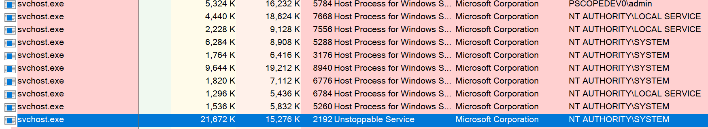

# Unstoppable Service

Build in Visual Studio (.net 3.5 so it runs on Win 7+). 

This is a proof of concept / pattern concept for creating a Windows service in C# that is self installing as a single executable and sets proper attributes to prevent an administrator from stopping or pausing the service through the Windows Service Control Manager interface.

Caveat: Unstoppable via SC does not mean it is a process that is immune to being killed as a process. 

